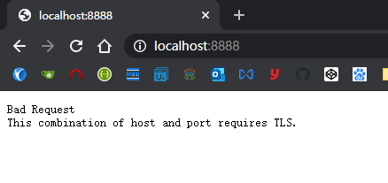
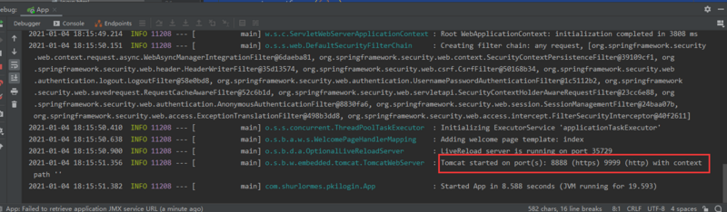

要让项目实现**ssl**免密登录，首先需要开启**https**。
所以先从**Spring Boot**如何开启**https**说起。

#### 创建服务端证书
* * *

为了开启**https**，我们需要一份证书。

实际开发中，会在网上申请一个机构颁发的证书。这里为了方便，我会使用**openssl**命令自己生成一个证书来使用。
```
openssl req -x509 -sha256 -days 3650 -newkey rsa:4096 -keyout rootCA.key -out rootCA.crt
```


所有的密码都是**123456**，然后根据提示输入相关信息就好，如果嫌麻烦也可以直接回车跳过。

这样我们就得到了证书**rootCA.crt**和私钥**rootCA.key**。

要在**Spring Boot**中实现服务器端**X.509**身份验证，还需要给我们的服务端也生成一个证书。
```
openssl req -new -newkey rsa:4096 -keyout localhost.key -out localhost.csr
```

同样，密码是**123456**，文件名**localhost**可以自行修改。

接下来就是用**rootCA**给我们的服务端证书做签名了，在此之前，我们先写一个配置文件，里面写有一些基本的配置

```
vi conf.config
```
```
authorityKeyIdentifier=keyid,issuer
basicConstraints=CA:FALSE
subjectAltName = @alt_names
[alt_names]
DNS.1 = localhost
```

其中**DNS.1**的值就是你的域名，比如**www.segmentfault.com**，**localhost**等等。如果这里填错了，访问网站时，浏览器会提示网站不安全。

然后给服务端证书签名，会提示你输入**rootCA**的密码
```
openssl x509 -req -CA rootCA.crt -CAkey rootCA.key -in localhost.csr -out localhost.crt -days 365 -CAcreateserial -extfile conf.config
```

成功后，让我们查看一下证书的信息
```
openssl x509 -in localhost.crt -text
```


最后再将签名证书和私钥打包到**PKCS**文件中
```
openssl pkcs12 -export -out localhost.p12 -name "localhost" -inkey localhost.key -in localhost.crt
```

这条指令会要你先输入**localhost.key**的密码，然后再要你定义**localhost.p12**的密码。**localhost.p12**这个密码一定要记住，因为在**Spring**的配置文件中有用到。
另外需要特别注意的是，**Spring**配置文件中**server.ssl.keyAlias**的值，就是命令中的**localhost（-name "localhost"）**。

#### Spring Boot开启https
* * *

把**localhost.p12**复制到**resources**目录下之后编译项目


修改**application.properties**文件
```
server.port=8888
server.ssl.key-store=classpath:localhost.p12
server.ssl.key-store-password=123456
server.ssl.keyStoreType=PKCS12
server.ssl.keyAlias=localhost
```

在**chrome://settings/security**中，选择**受信任的根证书颁发机构**导入**rootCA.crt**


这时启动项目，就可以使用**https**访问网站了，而且浏览器提示网站是安全的。


#### 创建信托证书
* * *

信托证书中会存有**信任的外部实体的证书**
这里我们只要将**rootCA.crt**添加进去就可以了
```
keytool -import -trustcacerts -noprompt -alias ca -ext san=dns:localhost,ip:127.0.0.1 -file rootCA.crt -keystore localhost.jks
```

然后将**localhost.jks**添加到项目中，并修改配置文件


**application.properties**添加：
```
server.ssl.trust-store=classpath:localhost.jks
server.ssl.trust-store-password=123456
server.ssl.client-auth=need
```

**注意：此时由于添加了server.ssl.client-auth=need，因为没有添加个人证书，所以这个时候刷新页面，项目会无法访问，如果想要同时兼任普通登录，可以将need改成want，但是want只会在第一次访问页面时才会向客户索取个人证书**


#### 创建客户端证书
* * *

现在创建一个客户端的证书，步骤和服务端的差不多一样。
```
openssl req -new -newkey rsa:4096 -nodes -keyout shurlormes.key -out shurlormes.csr
```


在生成客户端证书时，那些信息不建议跳过，因为在后续的步骤中，会获取其中的信息用以登录。比如我在**Common Name**处填写的信息，就是等下用来登录的用户名。

接下来用**RootCA**给客户端证书签名
```
openssl x509 -req -CA rootCA.crt -CAkey rootCA.key -in shurlormes.csr -out shurlormes.crt -days 365 -CAcreateserial
```

然后再将签名证书和私钥打包到**PKCS**文件中
```
openssl pkcs12 -export -out shurlormes.p12 -name "shurlormes" -inkey shurlormes.key -in shurlormes.crt
```

最后在**chrome://settings/security**选择**个人证书**把**shurlormes.p12**导入，期间会要你输入它的密码。


这时候刷新页面，浏览器就会弹出一个对话框，让你选择个人认证了。


#### Spring Boot获取个人证书信息
* * *

恭喜你，到了这一步，**pki**登录已经完成了**99%**了。接下来就是通过**request**获取证书信息，然后处理字符串，拿到用户名做登录即可。

```
@RequestMapping("/login")
public String login(HttpServletRequest request) {
    X509Certificate[] certs = (X509Certificate[]) request.getAttribute("javax.servlet.request.X509Certificate");
    if(certs != null) {
        X509Certificate gaX509Cert = certs[0];
        String dn = gaX509Cert.getSubjectDN().toString();
        System.out.println("个人证书信息:" + dn);
        String username = "";
        String[] dnArray = dn.split(",");
        for (String dnItem : dnArray) {
            String[] dnInfo = dnItem.split("=");
            String key = dnInfo[0];
            String value = dnInfo[1];
            if("cn".equalsIgnoreCase(key.trim())) {
                username = value;
                break;
            }
        }
        System.out.println("用户名:" + username);

        if(!StringUtils.isEmpty(username)) {
            SecurityContext securityContext = SecurityContextHolder.getContext();
            User userDetails = new User(username, "", Collections.EMPTY_LIST);
            securityContext.setAuthentication(new UsernamePasswordAuthenticationToken(userDetails, "", Collections.EMPTY_LIST));
            return "redirect:/";
        }

    }
    return "login";
}
```


#### Spring Boot 同时开启http和https
* * *

相信大家都发现了，现在项目只能通过**https**访问，如果用**http**访问浏览器直接返回**Bad request**了。



要同时开启**https**和**http**，只需添加一个**TomcatConfig**就可以

```
@Configuration
public class TomcatHttpConfig {
    @Bean
    public TomcatServletWebServerFactory servletContainer() {
        TomcatServletWebServerFactory tomcat = new TomcatServletWebServerFactory();
        tomcat.addAdditionalTomcatConnectors(initiateHttpConnector());
        return tomcat;
    }

    private Connector initiateHttpConnector() {
        Connector connector = new Connector("org.apache.coyote.http11.Http11NioProtocol");
        connector.setScheme("http");
        connector.setPort(9999);
        connector.setSecure(false);
        return connector;
    }
}
```

这时候启动项目，注意看控制台打印的信息。



说明已经成功启动**http**在端口**9999**，**https**在**8888**，页面也可以成功访问了。


#### Spring Boot http自动跳转https
* * *

上面我们已经可以同时访问**http**和**https**，但如果我要访问**http**的时候，自动跳转的**https**呢？
只需要在上面的基础上稍微改改就可以了。
```
@Configuration
public class TomcatHttpConfig {
    @Bean
    public TomcatServletWebServerFactory servletContainer() {
        TomcatServletWebServerFactory tomcat = new TomcatServletWebServerFactory() {
            @Override
            protected void postProcessContext(Context context) {
                SecurityConstraint securityConstraint = new SecurityConstraint();
                securityConstraint.setUserConstraint("CONFIDENTIAL");
                SecurityCollection collection = new SecurityCollection();
                collection.addPattern("/*");
                securityConstraint.addCollection(collection);
                context.addConstraint(securityConstraint);
            }
        };
        tomcat.addAdditionalTomcatConnectors(initiateHttpConnector());
        return tomcat;
    }

    private Connector initiateHttpConnector() {
        Connector connector = new Connector("org.apache.coyote.http11.Http11NioProtocol");
        connector.setScheme("http");
        connector.setPort(9999);
        connector.setSecure(false);
        connector.setRedirectPort(8888);
        return connector;
    }
}
```

#### 踩坑总结
* * *

1. 把服务端证书**p12**文件添加到项目**resources**后，记得**rebuild**项目，否则**target**的**classes**中没有生成证书文件，会导致项目启动失败。
2. **application.properties**中的**server.ssl.keyAlias**需要和生成**p12**文件的**-name**一致，否则也会导致项目无法启动。
3. 如果要指定域名，需要修改**conf.confg**中的**DNS.1**，否则浏览器会提示网站不安全。


#### 参考资料
* * *

https://www.baeldung.com/x-509-authentication-in-spring-security